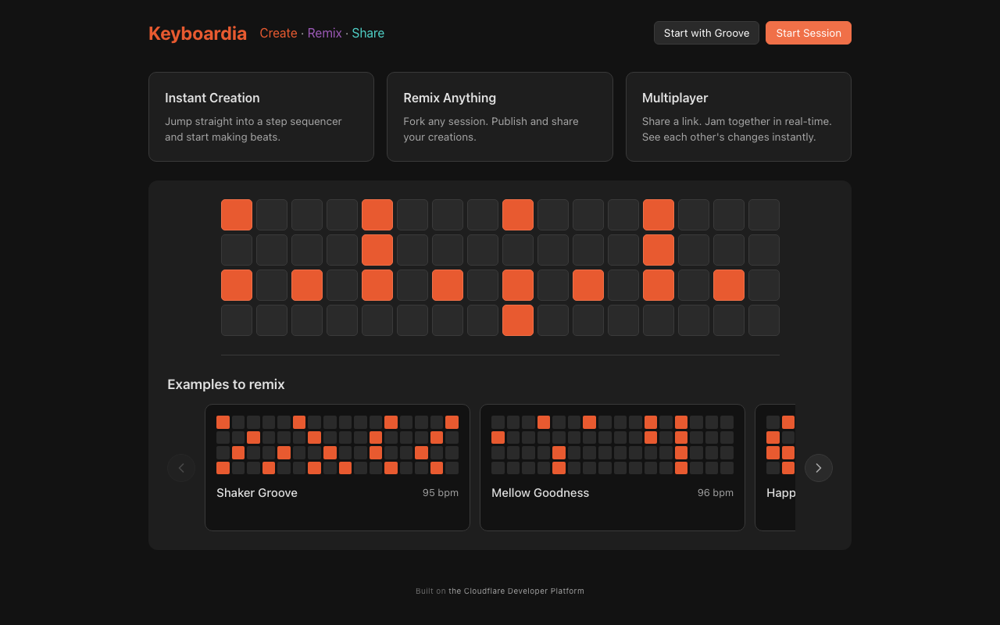
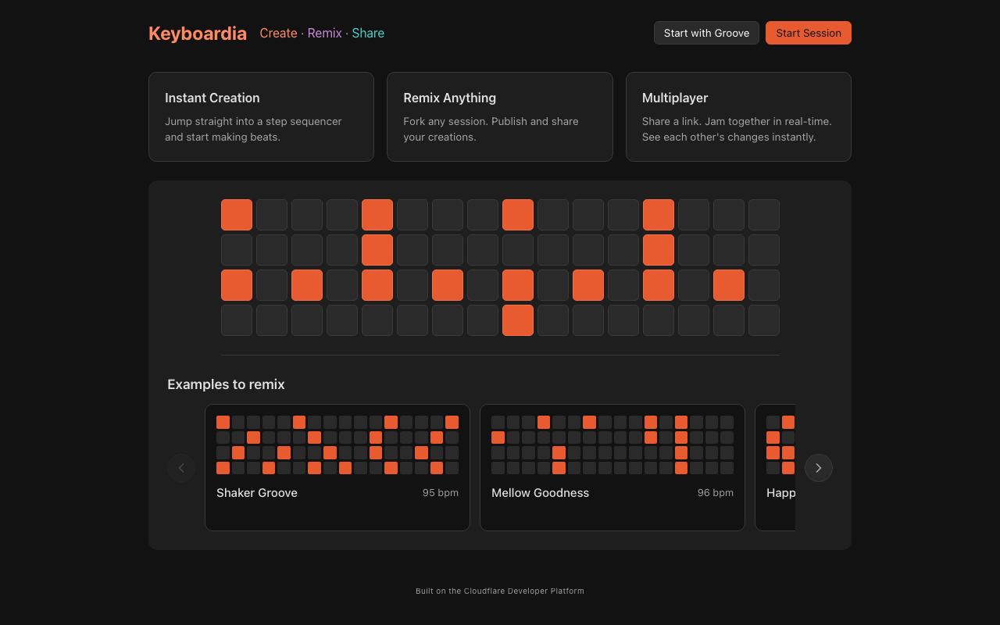
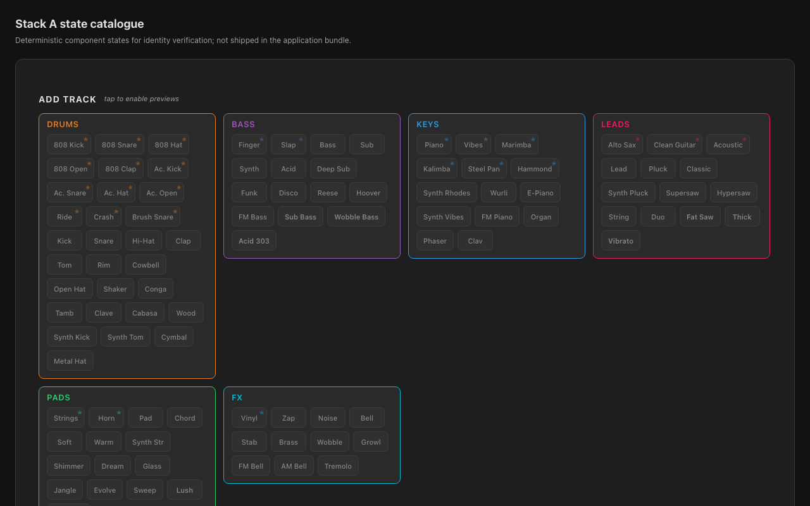
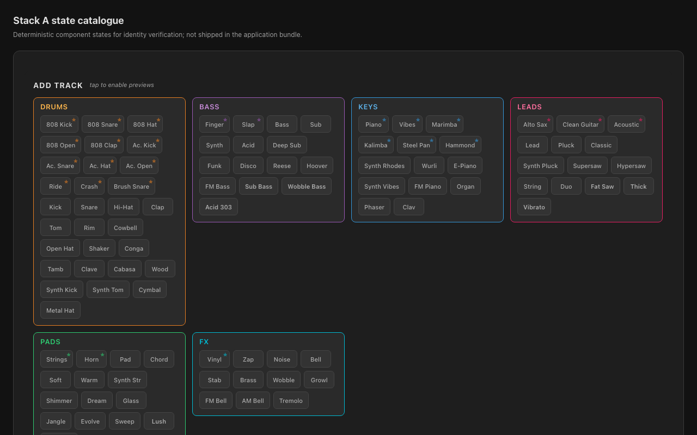

# Site colour-role before/after evidence

- Base: `8c0049109f5ee5de365eddcf8a0f64084e9817db` (the merged Stack B commit on `main`)
- Candidate source: `5b45ce9ffeccad23a8a3bb5def2e21326c9e242f`
- Generator: `app/identity/site-color-safety.spec.ts`, version 1
- Environment: Chromium 143 on macOS, CSS pixel scale 1
- Inventory: 7 before/after/diff pairs; desktop, portrait, and landscape
- Changed pixels above the 6/255 raster allowance: 73,893

The accompanying identity suite separately proves equal accessibility trees,
equal visible geometry, exact non-approved computed styles, and zero changed
pixels outside elements with an approved old→new colour-role pair. The
exception activates only for the exact base SHA above and expires afterwards.
For deterministic captures, the landing demo's decorative playhead and its
cell transition are neutralized in both revisions; production timing and
appearance are not changed.

## Landing, desktop

| Before | Candidate source |
| --- | --- |
|  |  |

The visual hierarchy and flat material treatment are unchanged. The title and
tagline retain their hues; the primary action changes to dark ink so it clears
4.5:1 in both rest and hover states.

## Sample picker, desktop

| Before | Candidate source |
| --- | --- |
|  |  |

Category borders and fills retain the original palette. Only the small text
role changes; available buttons no longer inherit the preview container's
opacity, while actual disabled controls retain their disabled opacity.

## Responsive pairs

| State | Before | Candidate source |
| --- | --- | --- |
| Landing portrait, 375×812 | [PNG](before/landing-375x812.png) | [PNG](after/landing-375x812.png) |
| Landing landscape, 844×390 | [PNG](before/landing-844x390.png) | [PNG](after/landing-844x390.png) |
| Landing primary hover, 1280×800 | [PNG](before/landing-primary-hover-1280x800.png) | [PNG](after/landing-primary-hover-1280x800.png) |
| Picker portrait, 375×812 | [PNG](before/picker-375x812.png) | [PNG](after/picker-375x812.png) |
| Picker landscape, 844×390 | [PNG](before/picker-844x390.png) | [PNG](after/picker-844x390.png) |

Every receipt records the exact revisions, viewport, environment, image hashes,
and pixel metrics. `approval-manifest.json` hash-binds this README plus every
receipt and PNG; it deliberately cannot bind itself.
