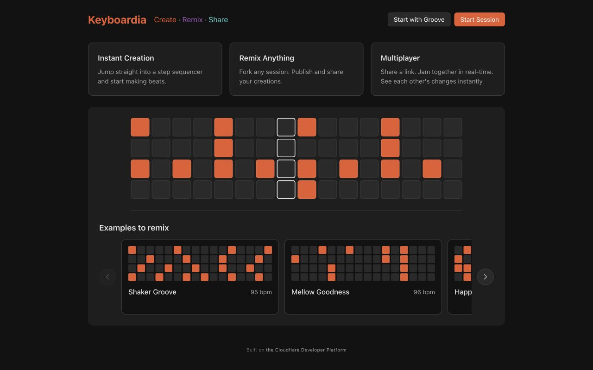
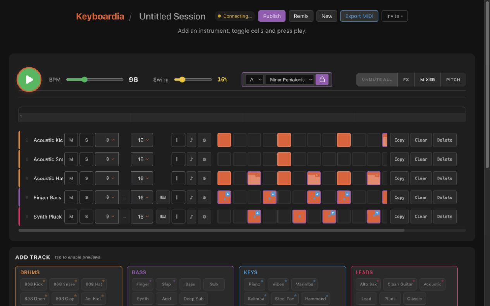
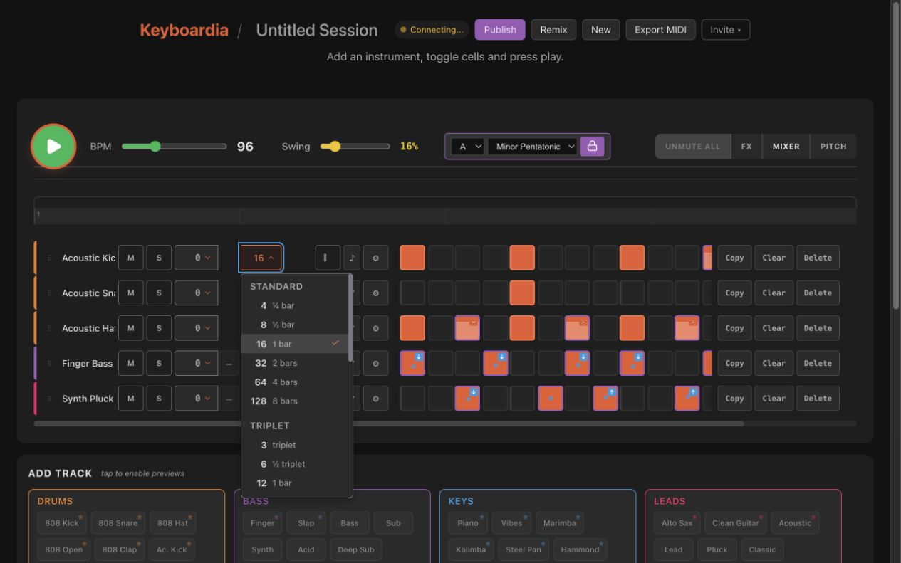
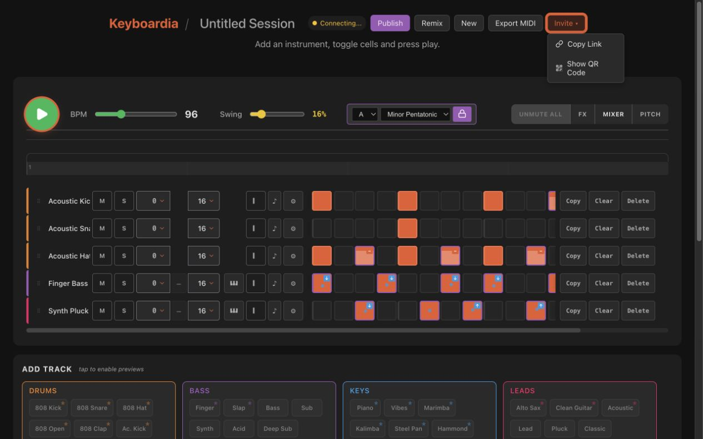
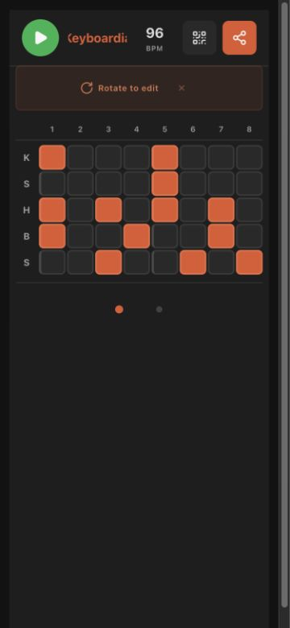
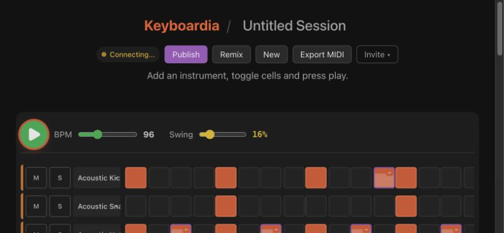

# Post-flatten site-wide consistency audit

Audited 22 August 2026 against the flattened candidate pixels subsequently
bound to the exact source revision in `stack-b-evidence/approval-manifest.json`.
The browser run used Keyboardia's deterministic mock-backed local app and fresh
screenshots at desktop, mobile portrait, and mobile landscape.

## Verdict

The bounded flattening resolves both Stack B inconsistencies found in the
previous audit without removing its accessibility or behavioural repairs. It
does not make the whole product WCAG-conformant: this repeat audit also found
pre-existing small-text palette failures outside Stack B, recorded below.

- Dropdowns no longer introduce a private `.68` neutral text tier. Visible
  dropdown text uses the same `.87` primary and `.60` muted tiers as the site.
- Neutral trigger, menu, hover, and selected surfaces are flat and reuse the
  site's existing surface tokens.
- The menu now exactly matches the Invite popup's fill (`#2a2a2a`), 6px radius,
  single external shadow, primary text tier, and lack of gradient/inset texture.
- Dropdown edges remain deliberately stronger than Invite's legacy `#444` edge
  because each Stack B boundary independently clears WCAG 1.4.11's 3:1
  non-text contrast threshold.
- Orange remains the open/hover/selection accent; blue remains the focus and
  active-transpose colour. Focus ownership after selection and Escape, touch
  behaviour, and outside-click focus preservation remain directly tested.

## Fresh evidence

### 1. Landing page — Stack B unaffected; legacy text issues remain

### 2. Populated desktop session — Stack B healthy

The controls now share the flat material used by adjacent track actions and
the Add Track cards. The stronger neutral edge is an accessibility boundary,
not a texture.

### 3. Shared dropdown open — healthy

The menu uses flat global surfaces and text tiers. Selection is a quiet flat
active row plus the approved orange check, with no leading rail or tinted accent
wash.

### 4. Existing Invite popup — useful material comparator

The dropdown and Invite popup now share fill, radius, shadow, primary text, and
flat option treatment. Only the dropdown's independently accessible edge is
stronger.

### 5. Mobile portrait — Stack B unaffected, separate UI

Portrait continues to use the dedicated touch sequencer. Stack B's custom
editing dropdowns are absent, and the retained touch-focus contract passes in
WebKit.

### 6. Mobile landscape — healthy for Stack B scope

Landscape continues to omit the custom Step and Transpose controls. The known
component-catalogue popup overflow at short landscape heights remains an
unchanged Stack C limitation rather than a Stack B regression.

## Measured text hierarchy

With a populated desktop session and Step menu open, visible direct-text nodes
used the following neutral colours:

| Scope | `.87` primary | `.60` muted | `.38` dimmed | `.68` private tier |
| --- | ---: | ---: | ---: | ---: |
| Site outside dropdowns | 30 | 286 | 2 | 0 |
| Dropdown triggers | 4 | 5 | 0 | 0 |
| Open dropdown menu | 26 | 29 | 0 | 0 |

Exact white and feature colours still appear for glyphs and semantic musical
states. They are intentional uses of the product palette, not neutral hierarchy
drift.

## Measured material recipes

| Element | Fill | Edge | Radius | Shadow |
| --- | --- | --- | --- | --- |
| Invite popup | Flat `#2a2a2a` | `#444` | 6px | `0 4px 12px rgba(0,0,0,.3)` |
| Stack B trigger | Flat `#2a2a2a` | `#6c6c76` | 6px base; group corners owned by `TrackRow` | None |
| Stack B menu | Flat `#2a2a2a` | `#74747f` | 6px | `0 4px 12px rgba(0,0,0,.3)` |
| Hover / selection | Flat `#333` / `#444` | Semantic focus only | 0 inside menu | None |

Measured candidate contrast remains: control edge 3.21:1; menu edge 3.11:1
against its own fill and 3.61:1 against the card; scrollbar 3.29:1; option
focus at least 3.09:1; orange selected check 3.30:1; active transpose text
5.48:1 on hover and 6.23:1 closed.

## Pre-existing site-wide accessibility findings

These findings were exposed by the broader repeat audit but were not introduced
or changed by Stack B:

1. `--color-text-dimmed` (`rgba(255,255,255,.38)`) provides only 3.24–3.57:1
   across the site's common dark surfaces. It is used for informative 9–10px
   text including footer copy, transport labels, drawer headings, XY values,
   placeholders, and counts, so those uses fail WCAG 1.4.3's 4.5:1 threshold.
2. Some feature colours are safe as decoration but not as small text. Measured
   examples include the landing-page purple “Remix” at 4.01:1, white CTA text
   on orange at 3.54:1 and 2.95:1 on hover, and the SamplePicker Bass/Leads
   headings at 3.07:1 and 3.30:1.

The forward fix is to classify palette tokens by permitted role and introduce
text-safe variants where needed. Weakening Stack B's boundaries or reverting
its shared text tiers would not address these global failures.

## Limits

This is a focused colour, material, responsive, and interaction audit rather
than full WCAG conformance testing. The mock-backed session remained in its
`Connecting…` state, so connected/offline/error status colours were not covered.
The audit also does not cover forced-colours mode, physical-device browser
chrome/safe areas, live WebSocket collaboration, or the pre-existing
component-only short-landscape popup containment limitation.
