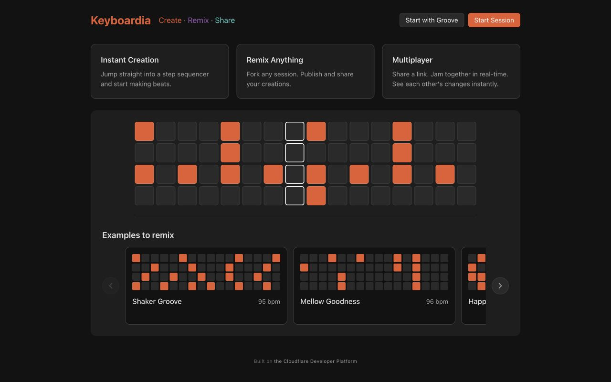
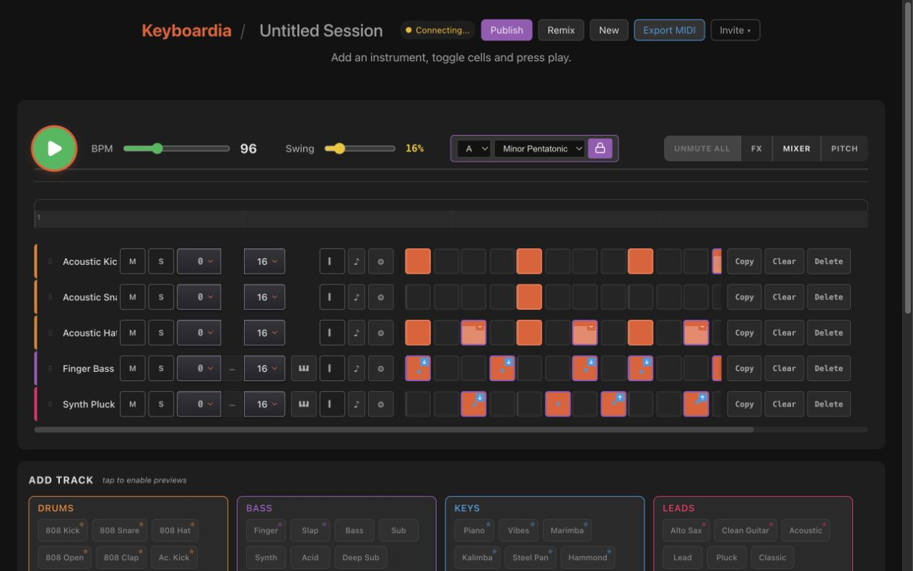
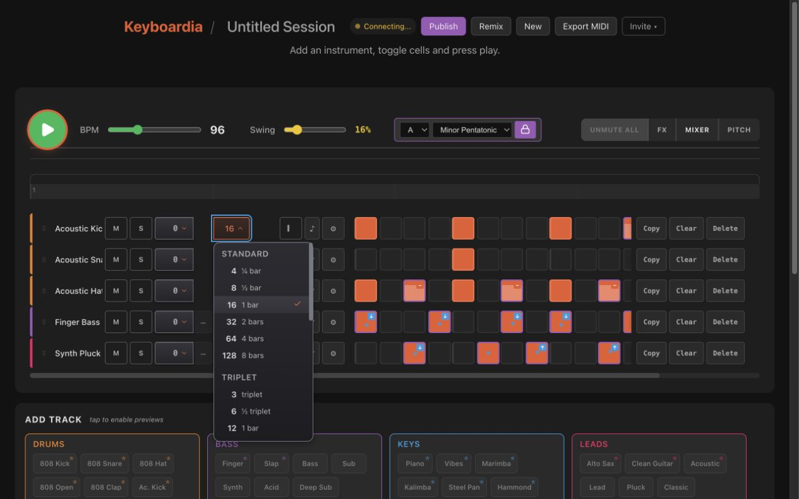
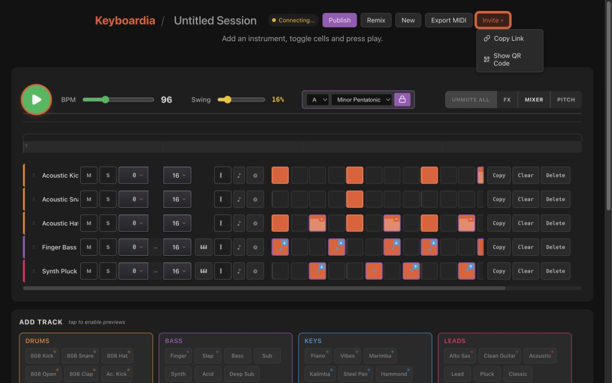
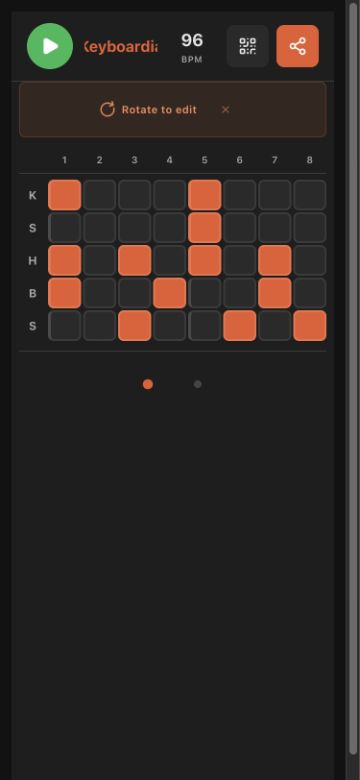
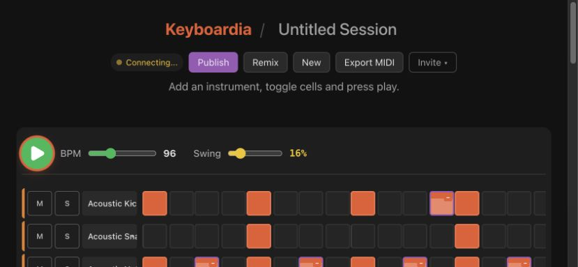
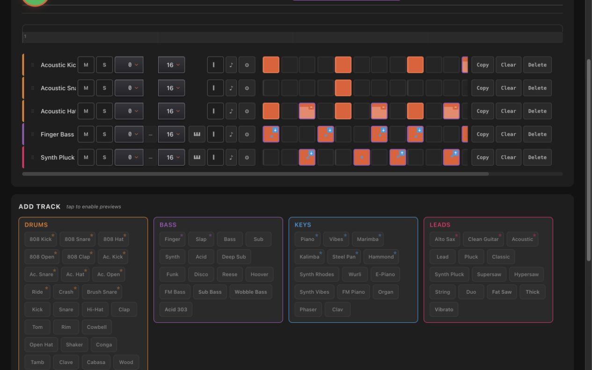

# Site-wide colour and material consistency audit

Audited 22 August 2026 against Stack B candidate head `7e6c05c`. The browser run used Keyboardia's mock-backed local app so the populated session was deterministic. The audit covered the landing page, populated desktop session, closed and open custom dropdowns, the existing Invite menu, adjacent track controls, Add Track surfaces, mobile portrait, and compact mobile landscape.

## Verdict

The concern is valid. Stack B has not made all site text inconsistent, and its accessibility repairs are valuable, but it has introduced two local design dialects:

1. `rgba(255, 255, 255, 0.68)` is a dropdown-only secondary text tier. The established site hierarchy is `0.87 / 0.60 / 0.38`.
2. Neutral dropdown controls and menus now use gradients, inset highlights, stronger rounding, and control shadows. Adjacent Keyboardia controls and the existing Invite menu are predominantly flat.

The dropdowns belong to the same dark palette, but not quite to the same material system. Stack B should remain unapproved until a bounded flattening correction is reviewed.

## Evidence by state

### 1. Landing page — healthy

The landing page consistently uses flat `#1e1e1e` and `#2a2a2a` surfaces with the global primary and muted text tiers.

### 2. Populated desktop session — needs correction

The Step and Transpose triggers sit beside flat track controls. Their gradient, inset top highlight, and small drop shadow make them look more tactile than their peers.

### 3. Custom dropdown menu — needs correction

The menu is readable and its stronger lines are accessible, but the `#2c2c32` to `#1d1d21` gradient, inset highlight, and 10px radius form a richer material treatment than the surrounding product.

### 4. Existing Invite menu — healthy comparator

The site-native popup is flat `#2a2a2a`, has a `#444` edge, 6px radius, and a single external shadow. This is the closest existing menu grammar.

### 5. Mobile portrait — healthy, separate UI

Portrait uses the dedicated flat touch sequencer. Step and Transpose dropdowns are not present, so Stack B does not create a portrait inconsistency.

### 6. Compact mobile landscape — healthy for Stack B scope

The compact landscape UI also omits the Step and Transpose controls. Its buttons and cells remain flat. The component-catalogue menu overflow at short landscape heights is still a separate Stack C limitation.

### 7. Wider control surfaces — healthy comparator

Track actions, category cards, and instrument choices reinforce the flat-surface pattern. Feature colours communicate instrument category or state; they are not neutral decoration.

## Measured text hierarchy

With the populated session and Step menu open, visible direct-text nodes used:

| Scope | Primary | Muted | Dimmed | Dropdown-only |
| --- | ---: | ---: | ---: | ---: |
| Outside the menu | 34 at `0.87` | 291 at `0.60` | 2 at `0.38` | 0 at `0.68` |
| Inside the menu | 26 at `0.87` | 3 at `0.60` | 0 | 26 at `0.68` |

Exact white and feature colours also appear outside the menu for glyphs and semantic states. Those uses are intentional. The inconsistency is the extra neutral `0.68` tier, not the semantic palette.

## Measured material recipes

| Element | Fill | Edge | Radius | Shadow |
| --- | --- | --- | --- | --- |
| Adjacent track actions | Flat `#2a2a2a` or transparent | `#444` or `#555` | 4px | None |
| Add Track choices | Flat `#333` | `#444` | 6px | None |
| Existing Invite menu | Flat `#2a2a2a` | `#444` | 6px | `0 4px 12px rgba(0,0,0,.3)` |
| Stack B trigger | Gradient `#34343a` to `#242429` | `#6c6c76` | 7px base; 4px in track group | Inset highlight plus drop shadow |
| Stack B menu | Gradient `#2c2c32` to `#1d1d21` | `#74747f` | 10px | Inset highlight plus drop shadow |

The repository-wide gradient inventory supports the visual finding: most other gradients encode meters, pitch, active steps, loading, or other functional/semantic states. Stack B is unusual because it applies texture to neutral controls.

## Bounded Stack B correction

- Use the global `--color-text-muted` (`0.60`) for dropdown secondary labels. Keep hierarchy through size, weight, and position rather than a private opacity tier.
- Make closed triggers flat `--color-surface-elevated`; make hover flat `--color-surface-hover`; keep the open orange state but use a flat muted-accent surface.
- Make menus flat `--color-surface-elevated`, use the existing 6px popup radius, remove the inset highlight, and use the existing Invite-menu shadow.
- Make option hover flat `--color-surface-hover` and selection flat `--color-surface-active` with the already-approved orange check.
- Preserve the stronger Stack B edge tokens. Simply reverting to `#444` or `#555` would undermine the independently required WCAG 1.4.11 boundary contrast.
- Preserve the blue focus treatment, active Transpose contrast repair, focus restoration after selection and Escape, and outside-click focus ownership.

This is a visual correction, so it requires a new source SHA, regenerated before/after evidence, renewed approval, and updated PR/issue metadata. It does not require a site-wide redesign or spreading the dropdown texture to other components.

## Accessibility and audit limits

Current Stack B evidence establishes at least 3:1 contrast for the neutral control/menu/scrollbar boundaries and 4.5:1 for the repaired active Transpose text. The proposed flattening should retain those thresholds and exact assertions.

This audit used screenshots, computed browser styles, repository CSS, and responsive viewport checks. It is not a complete WCAG conformance assessment and does not cover forced-colours mode, browser chrome/safe areas on physical devices, every transient animation, or live WebSocket collaboration state.
