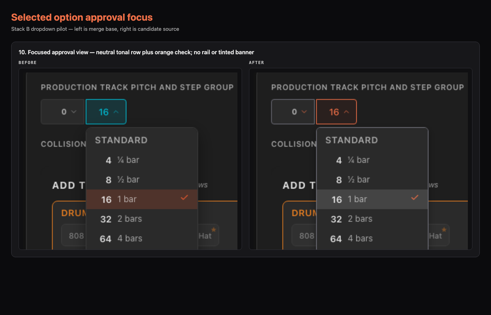

# Stack B dropdown evidence

This is the maintainer-approval package for the complete dropdown visual pilot.
Every pair shows the merge base on the left and the candidate source revision
on the right. The full-resolution images, changed-pixel visualizations, review
crops, and JSON hash receipts are retained beside these contact sheets.

## Review sheets




## Evidence contract

<!-- generated-evidence-summary:start -->
- Merge base: `58264dd5ae274f63b1cd80b72aa823b76b21f28b`
- Candidate source revision: `26e4d91a30db5bd2537a74c39afb0fc770ab7e77`
- Receipt generator: `app/identity/stack-b-visual.spec.ts` generator v6
- Human-review renderer: Chromium 143.0.7499.4, darwin 25.5.0
- Canonical machine authority: same-process Chromium comparisons on GitHub Actions Linux; committed review PNGs are provenance-bound evidence, not cross-platform pixel baselines
- Viewports: 1280×800, 375×812, 480×320, 768×1024, 769×1024, 844×390, 667×375, 1024×768
- Total named pairs: 29
- Intentionally changed pairs: 25
- Exact-identity product pairs: 4
- Pixels beyond the 6/255 raster allowance: 141,144 across the 25 changed pairs
- Accessibility trees: exact base/head identity
- Visible element and dropdown rectangles: exact base/head identity
- Non-decorative computed styles: exact base/head identity
- Pixels outside dropdown controls and their focus/shadow halos: 0
- Touch event payloads and dismissal: exact base/head identity in emulated-touch WebKit
<!-- generated-evidence-summary:end -->

The accessibility contracts directly assert focus restoration after both
dropdown selections, touch selection in both controls, and Escape from a
focused option. They also assert that an outside click keeps focus on the
clicked target.

CSS scorecard: 41 product CSS files (unchanged), 5,055 declarations (+19),
11,016 lines (+29), 131 shared-dropdown declarations (+4), 340 raw colors
outside `index.css` (-6), zero duplicated dropdown declarations (unchanged),
and 20 `!important` declarations (unchanged).

The raw changed-pixel count is descriptive, not a tolerance. Each changed
pixel must fall inside the approved target regions; unchanged product modes
still require zero changed pixels beyond the 6/255 same-process raster allowance.

## Regenerate and verify

From `app/`, with a clean tracked worktree at the source revision:

```sh
STACK_B_WRITE_EVIDENCE=1 npx playwright test --config playwright.stack-a.config.ts --project=stack-b-chromium
node scripts/build-stack-b-contact-sheets.mjs
node scripts/finalize-stack-b-evidence.mjs
npm run validate:stack-b-evidence
```

If those local ports are occupied, set `STACK_A_COMPARISON_PORT`,
`STACK_A_BASE_PRODUCT_PORT`, and `STACK_A_HEAD_PRODUCT_PORT` to three free
ports on the Playwright command.

The test writes receipts only after ARIA, geometry, style containment, pixel
containment, and the expected changed/identical result pass. The finalizer binds
the README, receipts, raw images, review crops, contact sheets, reference, and
QA comparison into `approval-manifest.json`. CI verifies the hashes and rejects
any non-evidence change after the recorded source revision.

## State inventory

| # | State | Before | After | Intent |
|---:|---|---|---|---|
| 1 | Closed triggers | [PNG](before/catalogue--dropdowns-default-collision-canary.png) | [PNG](after/catalogue--dropdowns-default-collision-canary.png) | Flat shared surface, accessible edge, orange chevrons, no trigger shadow |
| 2 | Selected values | [PNG](before/catalogue--dropdowns-selected.png) | [PNG](after/catalogue--dropdowns-selected.png) | Same flat treatment with non-default values |
| 3 | Disabled | [PNG](before/catalogue--dropdowns-disabled.png) | [PNG](after/catalogue--dropdowns-disabled.png) | Shared flat surface under unchanged opacity |
| 4 | Keyboard focus | [PNG](before/catalogue--step-count-focused.png) | [PNG](after/catalogue--step-count-focused.png) | 2px information-blue focus outline |
| 5 | Trigger hover | [PNG](before/catalogue--step-count-trigger-hover.png) | [PNG](after/catalogue--step-count-trigger-hover.png) | Shared flat hover surface and orange edge |
| 6 | Active transpose hover | [PNG](before/catalogue--transpose-active-trigger-hover.png) | [PNG](after/catalogue--transpose-active-trigger-hover.png) | Lighter feature blue remains legible on the flat hover surface |
| 7 | Step selection result | [PNG](before/catalogue--step-count-selection.png) | [PNG](after/catalogue--step-count-selection.png) | Event remains exact; focus returns to trigger |
| 8 | Transpose Escape result | [PNG](before/catalogue--transpose-escape.png) | [PNG](after/catalogue--transpose-escape.png) | Dismissal remains exact; focus returns to trigger |
| 9 | Transpose selection result | [PNG](before/catalogue--transpose-selection.png) | [PNG](after/catalogue--transpose-selection.png) | Event remains exact; focus returns to trigger |
| 10 | Step menu open | [PNG](before/catalogue--step-count-open.png) | [PNG](after/catalogue--step-count-open.png) | Flat menu and selected row with the orange semantic check |
| 11 | Transpose menu open | [PNG](before/catalogue--transpose-open.png) | [PNG](after/catalogue--transpose-open.png) | Same shared flat hierarchy |
| 12 | Transpose option hover | [PNG](before/catalogue--transpose-option-hover.png) | [PNG](after/catalogue--transpose-option-hover.png) | Shared flat hover surface |
| 13 | Transpose option focus | [PNG](before/catalogue--transpose-option-focused.png) | [PNG](after/catalogue--transpose-option-focused.png) | Information-blue inset outline; no orange halo |
| 14 | Reduced-motion menu | [PNG](before/catalogue--step-count-open-reduced-motion.png) | [PNG](after/catalogue--step-count-open-reduced-motion.png) | Same settled pixels; animation remains removed |
| 15 | Component portrait step | [PNG](before/catalogue--step-count-open-mobile-portrait.png) | [PNG](after/catalogue--step-count-open-mobile-portrait.png) | Responsive step menu |
| 16 | Component portrait header hover | [PNG](before/catalogue--step-count-header-hover-mobile-portrait.png) | [PNG](after/catalogue--step-count-header-hover-mobile-portrait.png) | Responsive header hover |
| 17 | Component portrait transpose | [PNG](before/catalogue--transpose-open-mobile-portrait.png) | [PNG](after/catalogue--transpose-open-mobile-portrait.png) | Responsive transpose menu |
| 18 | Component compact landscape | [PNG](before/catalogue--step-count-open-mobile-landscape-compact.png) | [PNG](after/catalogue--step-count-open-mobile-landscape-compact.png) | Responsive step menu fixture |
| 19 | Component wide landscape | [PNG](before/catalogue--transpose-open-mobile-landscape-wide.png) | [PNG](after/catalogue--transpose-open-mobile-landscape-wide.png) | Responsive transpose menu fixture |
| 20 | Component width 768 | [PNG](before/catalogue--step-count-open-width-768.png) | [PNG](after/catalogue--step-count-open-width-768.png) | Inclusive boundary styling |
| 21 | Component width 769 | [PNG](before/catalogue--step-count-open-width-769.png) | [PNG](after/catalogue--step-count-open-width-769.png) | Boundary-neighbour styling |
| 22 | Product desktop | [PNG](before/full-app--full-app-desktop-step-open.png) | [PNG](after/full-app--full-app-desktop-step-open.png) | All visible row triggers and open menu |
| 23 | Product portrait | [PNG](before/full-app--full-app-mobile-portrait-hidden.png) | [PNG](after/full-app--full-app-mobile-portrait-hidden.png) | Exact identity; editing dropdowns absent |
| 24 | Product compact landscape | [PNG](before/full-app--full-app-landscape-compact-unaffected.png) | [PNG](after/full-app--full-app-landscape-compact-unaffected.png) | Exact identity; TrackDrawer uses other controls |
| 25 | Product narrow landscape | [PNG](before/full-app--full-app-landscape-narrow-unaffected.png) | [PNG](after/full-app--full-app-landscape-narrow-unaffected.png) | Exact identity at 667×375; TrackDrawer uses other controls |
| 26 | Product wide landscape | [PNG](before/full-app--full-app-landscape-wide-unaffected.png) | [PNG](after/full-app--full-app-landscape-wide-unaffected.png) | Exact identity; TrackDrawer uses other controls |
| 27 | Product tablet landscape | [PNG](before/full-app--full-app-tablet-landscape-step-open.png) | [PNG](after/full-app--full-app-tablet-landscape-step-open.png) | Desktop editor styling at 1024×768 |
| 28 | Product width 768 | [PNG](before/full-app--full-app-width-768-step-open.png) | [PNG](after/full-app--full-app-width-768-step-open.png) | Production boundary styling |
| 29 | Product width 769 | [PNG](before/full-app--full-app-width-769-step-open.png) | [PNG](after/full-app--full-app-width-769-step-open.png) | Production boundary-neighbour styling |

## Approval

The maintainer selected Option 1, then requested that Stack B be flattened to
match the wider product while every focus-ownership, contrast, and behavioural
repair remains intact. The regenerated images require review. Once approved,
approval applies only to the exact merge base and candidate source revision
above; the following commit is evidence-only. Any merge-base movement or source
drift expires the package and requires a complete regeneration.
