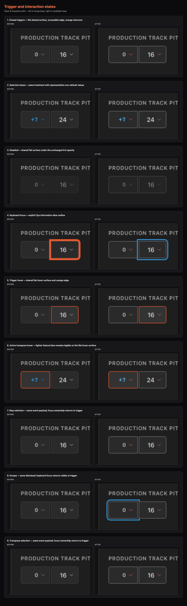
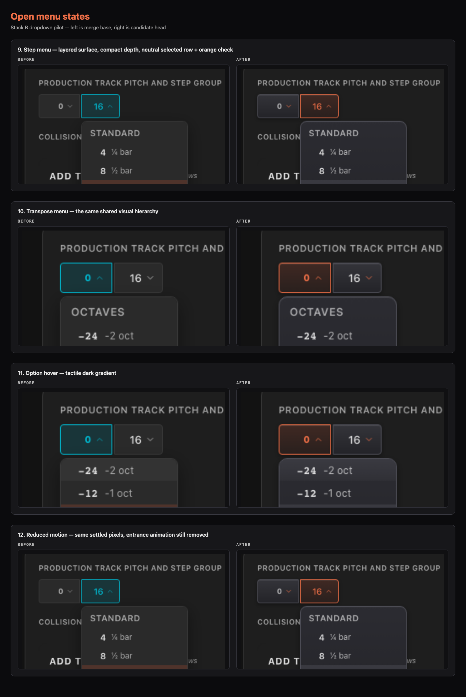
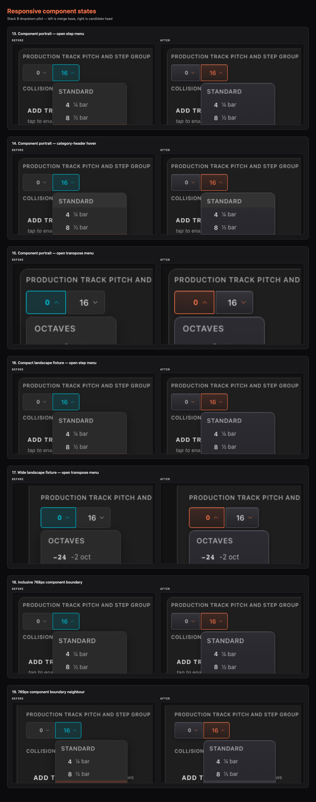
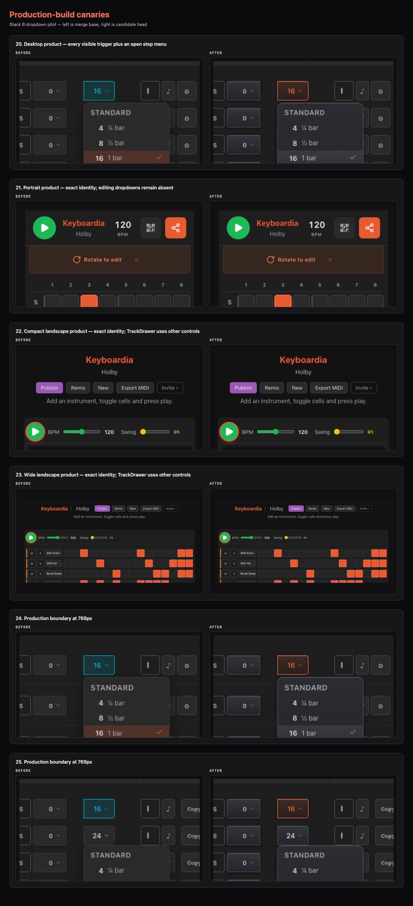

# Stack B dropdown evidence

This is the maintainer-approval package for the complete dropdown visual pilot.
Every pair shows merge base on the left and candidate head on the right. The
full-resolution images, changed-pixel visualizations, review crops, and JSON
hash receipts are retained beside these contact sheets.

## Review sheets

## Evidence contract

- Merge base: `58264dd5ae274f63b1cd80b72aa823b76b21f28b`
- Pixel authority: Chromium 143.0.7499.4, Playwright 1.57.0, macOS 26.5.1
- Viewports: 1280×800, 375×812, 480×320, 844×390, 768×1024, 769×1024
- Total named pairs: 25
- Intentionally changed pairs: 22
- Exact-identity product pairs: 3 (portrait, compact landscape, wide landscape)
- Pixels beyond the 6/255 raster allowance: 500,482 across the 22 changed pairs
- Accessibility trees: exact base/head identity
- Visible element and dropdown rectangles: exact base/head identity
- Non-decorative computed styles: exact base/head identity
- Pixels outside dropdown controls and their focus/shadow halos: 0
- Touch event payloads and dismissal: exact base/head identity in emulated-touch WebKit

CSS scorecard: 41 product CSS files (unchanged), 5,050 declarations (+14),
11,008 lines (+21), 128 shared-dropdown declarations (+1), 341 raw colors
outside `index.css` (-5), zero duplicated dropdown declarations (unchanged),
and 20 `!important` declarations (unchanged).

The raw changed-pixel count is descriptive, not a tolerance. Each changed
pixel must fall inside the approved target regions; unchanged product modes
still require zero changed pixels beyond the 6/255 same-process raster allowance.

## State inventory

| # | State | Before | After | Intent |
|---:|---|---|---|---|
| 1 | Closed triggers | [PNG](before/catalogue--dropdowns-default-collision-canary.png) | [PNG](after/catalogue--dropdowns-default-collision-canary.png) | Tactile surface, edge, shadow, orange chevrons |
| 2 | Selected values | [PNG](before/catalogue--dropdowns-selected.png) | [PNG](after/catalogue--dropdowns-selected.png) | Same treatment with non-default values |
| 3 | Disabled | [PNG](before/catalogue--dropdowns-disabled.png) | [PNG](after/catalogue--dropdowns-disabled.png) | New decoration under unchanged opacity |
| 4 | Keyboard focus | [PNG](before/catalogue--step-count-focused.png) | [PNG](after/catalogue--step-count-focused.png) | 2px information-blue focus outline |
| 5 | Trigger hover | [PNG](before/catalogue--step-count-trigger-hover.png) | [PNG](after/catalogue--step-count-trigger-hover.png) | Brighter gradient and orange edge |
| 6 | Step selection result | [PNG](before/catalogue--step-count-selection.png) | [PNG](after/catalogue--step-count-selection.png) | Styled closed result; event remains exact |
| 7 | Transpose Escape result | [PNG](before/catalogue--transpose-escape.png) | [PNG](after/catalogue--transpose-escape.png) | Styled closed result; dismissal remains exact |
| 8 | Transpose selection result | [PNG](before/catalogue--transpose-selection.png) | [PNG](after/catalogue--transpose-selection.png) | Styled closed result; event remains exact |
| 9 | Step menu open | [PNG](before/catalogue--step-count-open.png) | [PNG](after/catalogue--step-count-open.png) | Layered menu and neutral tonal selected row with orange check |
| 10 | Transpose menu open | [PNG](before/catalogue--transpose-open.png) | [PNG](after/catalogue--transpose-open.png) | Same shared visual hierarchy |
| 11 | Transpose option hover | [PNG](before/catalogue--transpose-option-hover.png) | [PNG](after/catalogue--transpose-option-hover.png) | Tactile option gradient |
| 12 | Reduced-motion menu | [PNG](before/catalogue--step-count-open-reduced-motion.png) | [PNG](after/catalogue--step-count-open-reduced-motion.png) | Same settled pixels; animation remains removed |
| 13 | Component portrait step | [PNG](before/catalogue--step-count-open-mobile-portrait.png) | [PNG](after/catalogue--step-count-open-mobile-portrait.png) | Responsive step menu |
| 14 | Component portrait header hover | [PNG](before/catalogue--step-count-header-hover-mobile-portrait.png) | [PNG](after/catalogue--step-count-header-hover-mobile-portrait.png) | Responsive header hover |
| 15 | Component portrait transpose | [PNG](before/catalogue--transpose-open-mobile-portrait.png) | [PNG](after/catalogue--transpose-open-mobile-portrait.png) | Responsive transpose menu |
| 16 | Component compact landscape | [PNG](before/catalogue--step-count-open-mobile-landscape-compact.png) | [PNG](after/catalogue--step-count-open-mobile-landscape-compact.png) | Responsive step menu fixture |
| 17 | Component wide landscape | [PNG](before/catalogue--transpose-open-mobile-landscape-wide.png) | [PNG](after/catalogue--transpose-open-mobile-landscape-wide.png) | Responsive transpose menu fixture |
| 18 | Component width 768 | [PNG](before/catalogue--step-count-open-width-768.png) | [PNG](after/catalogue--step-count-open-width-768.png) | Inclusive boundary styling |
| 19 | Component width 769 | [PNG](before/catalogue--step-count-open-width-769.png) | [PNG](after/catalogue--step-count-open-width-769.png) | Boundary-neighbour styling |
| 20 | Product desktop | [PNG](before/full-app--full-app-desktop-step-open.png) | [PNG](after/full-app--full-app-desktop-step-open.png) | All visible row triggers and open menu |
| 21 | Product portrait | [PNG](before/full-app--full-app-mobile-portrait-hidden.png) | [PNG](after/full-app--full-app-mobile-portrait-hidden.png) | Exact identity; editing dropdowns absent |
| 22 | Product compact landscape | [PNG](before/full-app--full-app-landscape-compact-unaffected.png) | [PNG](after/full-app--full-app-landscape-compact-unaffected.png) | Exact identity; TrackDrawer uses other controls |
| 23 | Product wide landscape | [PNG](before/full-app--full-app-landscape-wide-unaffected.png) | [PNG](after/full-app--full-app-landscape-wide-unaffected.png) | Exact identity; TrackDrawer uses other controls |
| 24 | Product width 768 | [PNG](before/full-app--full-app-width-768-step-open.png) | [PNG](after/full-app--full-app-width-768-step-open.png) | Production boundary styling |
| 25 | Product width 769 | [PNG](before/full-app--full-app-width-769-step-open.png) | [PNG](after/full-app--full-app-width-769-step-open.png) | Production boundary-neighbour styling |

## Approval

This evidence is a candidate, not an approval. Merge remains blocked until the
maintainer approves these pairs. Any merge-base movement expires the package
and requires a complete regeneration.
